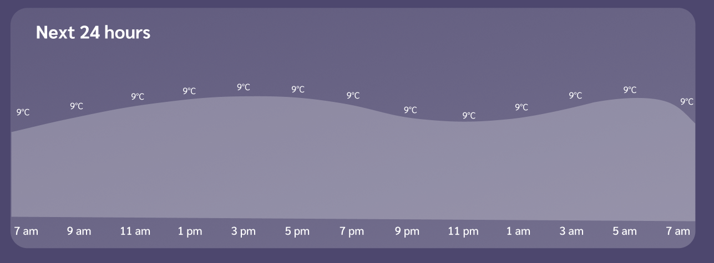

# Weather forecast

## 1. Requirements Analysis

### **Funcional Requirements**

- The app shows the browser's current location’s weather conditions including date, location, temperature, corresponding description of the weather, and icon (assume the user will accept geolocation requests from the browser).
- It should show an extended weather forecast for the next 5 days.
- App should show also current humidity, wind, and precipitation percentage (chances of rain).
- User can decide to use Celsius or Fahrenheit and save that selection for future usage (cookie or browser’s local storage).

### **Research & inspiration**

I was inspired by Google and Microsoft weather services, taking information structure, visual components and interactivity from them.


[https://www.msn.com/en-us/weather/forecast/in-Washington,DC](https://www.msn.com/en-us/weather/forecast/in-Washington,DC)


[https://www.google.com/search?q=Forecast+Weather](https://www.google.com/search?q=Forecast+Weather)

## 2. Resource Planning

Based on the structure of the data I found that the open weather free plan can fully cover all the required data.

### **API REST resource**

|                                | Free                                    |
| ------------------------------ | --------------------------------------- |
| API calls                      | 1,000 calls/day - 30,000 calls/month    |
| Current weather                | ✔                                       |
| Minute forecast 1 hour         | ✔                                       |
| Hourly forecast 48 hours       | ✔                                       |
| Daily forecast 7 days          | ✔                                       |
| National Weather Alerts        | ✔                                       |
| Historical weather data 5 days | ✔                                       |
| API calls                      | 60 calls/minute - 1,000,000 calls/month |
| Current Weather API            | ✔                                       |
| Hourly Forecast 4 days         | -                                       |
| 3-hour Forecast 5 days         | ✔                                       |
| Daily Forecast 16 days         | -                                       |
| Climatic Forecast 30 days      | -                                       |

[https://openweathermap.org/full-price](https://openweathermap.org/full-price)

### **Information Structure**

- **dt**: Current time, Unix, UTC
- **pop**: Probability of precipitation.

```json
{
  "forecast": {
    "city": { "name": "Washington D.C." }, // Name of the city
    "list": [
      // Every 3-hour - Forecast 5 days
      { "main": { "temp": 3.35 }, "dt": 1649678400, "pop": 0 },
      { "main": { "temp": 9.31 }, "dt": 1649689200, "pop": 0 }
      //... 40 registers
    ]
  },
  "weather": {
    "current": {
      "dt": 1649671967,
      "temp": 2.01,
      "humidity": 81,
      "wind_speed": 0,
      "weather": [
        {
          "main": "Clear",
          "description": "clear sky",
          "icon": "01n"
        }
      ]
    },
    "hourly": [
      // Every 1-hour - Forecast - 48 next hours
      { "dt": 1649671200, "temp": 2.01, "pop": 0 },
      { "dt": 1649674800, "temp": 2.45, "pop": 0 }
      //... 48 registers
    ],
    "daily": [
      // Every day - Forecast
      {
        "dt": 1649696400,
        "weather": [
          {
            "main": "Clouds",
            "description": "scattered clouds",
            "icon": "03d"
          }
        ],
        "pop": 0,
        "temp": { "day": 16.34, "min": 2.01, "max": 20.3 }
      }
      //... 6 registers
    ]
  }
}
```

[https://openweathermap.org/api/one-call-api](https://openweathermap.org/api/one-call-api)

[https://openweathermap.org/forecast5](https://openweathermap.org/forecast5)

## 3. Design

### \***\*Glassmorphism\*\***

From the microsoft weather forecast service I use glasmorphism, which is a style based on transparency


I design the visual components based on this style


### Icons

On github there is a repository of weather icons in two versions filled and outlied. I take the outlied version.


[https://basmilius.github.io/weather-icons/index-line.html](https://basmilius.github.io/weather-icons/index-line.html)

Of these I select the ones that match the list of openweather icons


[https://openweathermap.org/weather-conditions](https://openweathermap.org/weather-conditions)

### Graph

Both in microsoft and in google there is a graph that shows the evolution of the temperature throughout the day


I design a graph component that shows the temperature each day for both desktop and mobile

<div style="display:flex">
     <div style="padding-right:10px;width:90%;" >
          
     </div>
     <div style="padding-left:10px;width=10%;" >
          
     </div>
</div>

### Figma

Use figma software to design the user interface of the application, both for desktops and mobile.

<div style="display:flex">
     <div style="padding-right:10px;width:90%;" >
          
     </div>
     <div style="padding-left:10px;width=10%;" >
          
     </div>
</div>

<iframe style="border: 1px solid rgba(0, 0, 0, 0.1);" width="800" height="450" src="https://www.figma.com/embed?embed_host=share&url=https%3A%2F%2Fwww.figma.com%2Ffile%2Foxtq7PzoixHCXxNHpKF9lR%2FWeather-Forecast%3Fnode-id%3D0%253A1" allowfullscreen></iframe>

## 4. Development

### Architecture

**Requirements**

- Open Weather API KEY must not be visible to users.
- Free hosting and cloud services.
- Fast loading of the application.

**Architecture design**

- For the frontend in development, ReactJS is used in its version with TypeScript, the resulting files are hosted for free on github pages and made available for consumption 100% of the time.
- **I**n order not to expose the API we need to use server side as middleware, to fulfill two functions: the first is to add the API_KEY of openWeather and the second is to filter the data from open weather to the browser for a lower load of information.
- To implement this part of the server side, a firebase cloud function is used whose core is NodeJS and TypeScript is used in the development part.


### Server Development

**Clone the repository**

[`https://github.com/NestorPlasencia/forecast-weather.git`](https://github.com/NestorPlasencia/forecast-weather.git)

**Get an OpenWeatherMap API Key**

- Create an OpenWeatherMap account in [https://openweathermap.org/](https://openweathermap.org/)
- Get an OpenWeatherMap API key. [https://home.openweathermap.org/api_keys](https://home.openweathermap.org/api_keys)

**Insert API key to the project**

- Create an .env file at the `cloud-function/functions` folder.
- In the .env file insert your OpenWeatherMap API key.

`.env`

```
API_KEY=YOUR_API_KEY
```

**Install dependencies in `cloud-function/functions` fonder**

```sh
cd cloud-function/functions
```

Install dependencies

```sh
npm install
```

or

```
yarn install
```

Run the project function server

```
npm run serve
```

**Test server requests**

Go to the browser on:

[http://127.0.0.1:5001/forecast-project-cloud/us-central1/forecast](http://127.0.0.1:5001/forecast-project-cloud/us-central1/forecast)

the result should be the following

```
{"cod":"400","message":"wrong latitude"}
```

Add some latitute and longiturde

[http://127.0.0.1:5001/forecast-project-cloud/us-central1/forecast?lat=38.900497&lon=-77.007507](http://127.0.0.1:5001/forecast-project-cloud/us-central1/forecast?lat=38.900497&lon=-77.007507)

the result should be the following

```json
{
  "weather": {
    "current": {
      "dt": 1649678076,
      "temp": 4.4,
      "humidity": 77,
      "wind_speed": 0,
      "weather": [
        {
          "id": 800,
          "main": "Clear",
          "description": "clear sky",
          "icon": "01d"
        }
      ]
    },
    ...
}
```

### Frontend Development

**Follow the steps on server development**

**Install dependencies in `fronted` folder**

```
cd ../../frontend
```

Install dependencies

```
npm install
```

or

```
yarn install
```

Run the project function server

```
npm run start
```

**Test frontend**

Go to the browser on:

[http://localhost:3000/](http://localhost:3000/)

the result should be the following


## 5. Deploy

### Server deploy

**Install firebase tools**

```
npm install -g firebase-tools
```

**Go to the `cloud-function/functions` fonder**

```
cd ../cloud-function/functions
```

**Install dependencies**

```
npm install
```

or

```
yarn install
```

**Sign in to firebase**

```
firebase login
```

**Create a project with blaze plan**

[https://firebase.google.com/pricing](https://firebase.google.com/pricing)

**Deploy to yout firebase project**

```
npn run deploy
```

### Frontend deploy

**Fork the project on Github**

[https://docs.github.com/es/github-ae@latest/get-started/quickstart/fork-a-repo](https://docs.github.com/es/github-ae@latest/get-started/quickstart/fork-a-repo)

**Clone your project on your local development**

```
git clone https://github.com/<YourUserName>/forecast-weather.git
```

**Go to the frontend folder**

```
cd ../frontend
```

**Install dependencies**

```
npm install
```

or

```
yarn install
```

**Deploy to Github pages**

```
npm run deploy
```
